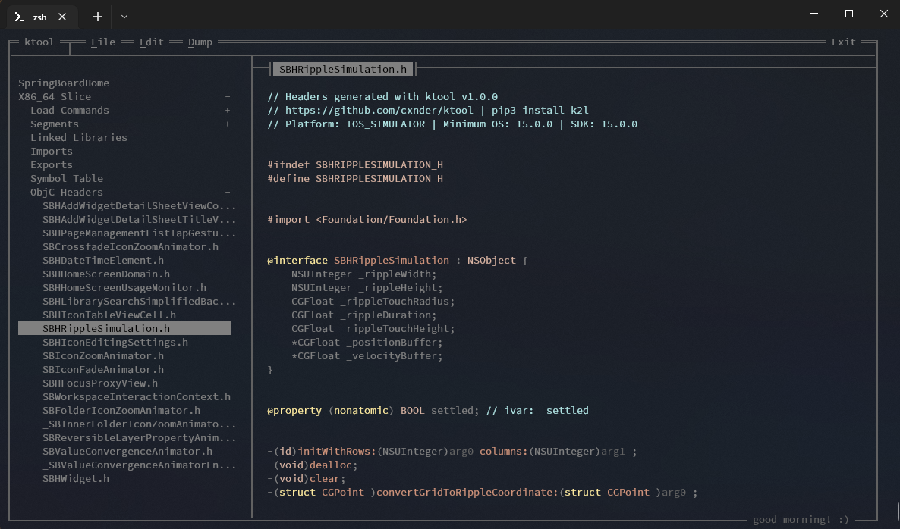

<p align="center">
<a href="https://github.com/0cyn/ktool/tree/master/EXTERNAL_LICENSES#image-notes">
   
</a>
</p>
<h4 align="center">
MachO/ObjC Analysis + Editing toolkit.
</h4>
<p align="center">
  <a href="https://github.com/kritantadev/ktool/actions/workflows/tests.yml">
    <image src="https://github.com/kritantadev/ktool/actions/workflows/tests.yml/badge.svg">
  </a>
  <a href="https://ktool.rtfd.io">
    <image src="https://readthedocs.org/projects/ktool/badge/?version=latest">
  </a>
  <a href="https://pypi.org/project/k2l/">
    <image src="https://badge.fury.io/py/k2l.svg">
  </a>
    <br>
</p>
    
<p align="center">
  <strong><a href="https://ktool.cynder.me/en/latest/ktool.html"> Library Documentation </a></strong>
  <br>
</p>
    


### Installation

```shell
# Installing
pip3 install k2l

# Updating
pip3 install --upgrade k2l
```

### Usage

ktool is both a convenient CLI toolkit and a library that can be used
in other tools.

##### CLI Usage
```
> $ ktool
Usage: ktool <global flags> [command] <flags> [filename]

Commands:

GUI (Still in active development) ---
    ktool open [filename] - Open the ktool command line GUI and browse a file

MachO Analysis ---
    dump - Tools to reconstruct certain files (headers, .tbds) from compiled MachOs
    json - Dump image metadata as json
    cs - Codesigning info
    kcache - Kernel cache specific tools
    list - Print various lists (ObjC Classes, etc.)
    symbols - Print various tables (Symbols, imports, exports)
    info - Print misc info about the target mach-o

MachO Editing ---
    insert - Utils for inserting load commands into MachO Binaries
    edit - Utils for editing MachO Binaries
    lipo - Utilities for combining/separating slices in fat MachO files.

Misc Utilities ---
    file - Print very basic info about the MachO
    img4 - IMG4 Utilities

Run `ktool [command]` for info/examples on using that command

Global Flags:
    -f - Force Load (ignores malformations in the MachO and tries to load whatever it can)
    -v [-1 through 5] - Log verbosiy. -1 completely silences logging.
    -V - Print version string (`ktool -V | cat`) to disable the animation
```

##### Library  

Library documentation is located [here](https://ktool.cynder.me/en/latest/ktool.html)

---

written in pure, 100% python for the sake of platform independence when operating on static binaries and libraries. 
this should run on any and all implementations of python3.
    
Tested on:
* Windows/Windows on ARM64
* MacOS x86/arm64
* Linux/Linux ARM64
* iOS (iSH, ssh)
* Android (Termux)
* WebAssembly
* Brython

#### Special thanks to

JLevin and *OS Internals for existing

arandomdev for guidance + code

Blacktop for their amazing ipsw project: https://github.com/blacktop/ipsw  

Artists behind the images used in this project's logo: https://github.com/0cyn/ktool/tree/master/EXTERNAL_LICENSES#image-notes
